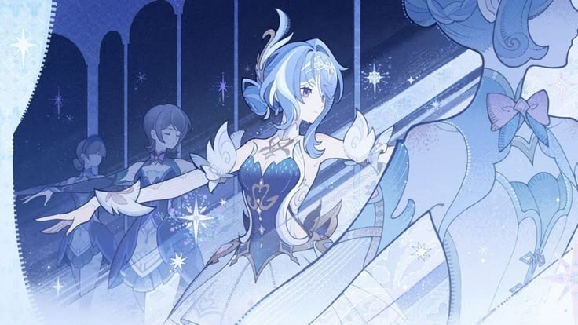

## Hi there 👋

<!--
**neechko/neechko** is a ✨ _special_ ✨ repository because its `README.md` (this file) appears on your GitHub profile.

Here are some ideas to get you started:

- 🔭 I’m currently working on ...
- 🌱 I’m currently learning ...
- 👯 I’m looking to collaborate on ...
- 🤔 I’m looking for help with ...
- 💬 Ask me about ...
- 📫 How to reach me: ...
- 😄 Pronouns: ...
- ⚡ Fun fact: ...
-->

  

<h1 align="center">neechko</h1>

  

  
  

---

## Tentang Saya

Saya adalah pemula yang baru terjun ke sini dan sedang membangun bot Discord dengan integrasi AI dan API pihak ketiga. Salah satunya **Mokachan**, bot companion berbasis Gemini yang juga memiliki sistem claim karakter anime otomatis dari AniList. Tertarik pada pengembangan backend, otomasi, dan hal-hal yang menghubungkan berbagai API.

## Tech Stack

  
  
  
  
  
  

## Proyek Unggulan

**Mokachan**
Bot Discord dengan AI companion (rolling summary dan memory facts, bukan riwayat mentah) serta sistem claim karakter anime otomatis dari AniList API. Seluruh data tersimpan di SQLite dengan tabel yang dibuat otomatis saat bot pertama kali dijalankan.

`Node.js` `Gemini API` `AniList API` `SQLite`

## Terhubung

  
  

<!-- ## Statistik GitHub

  
  

  

 -->
